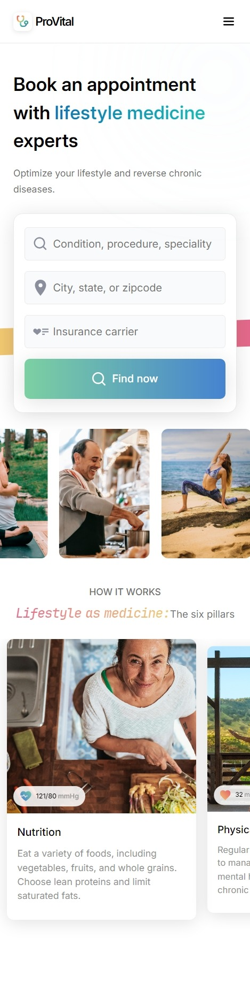
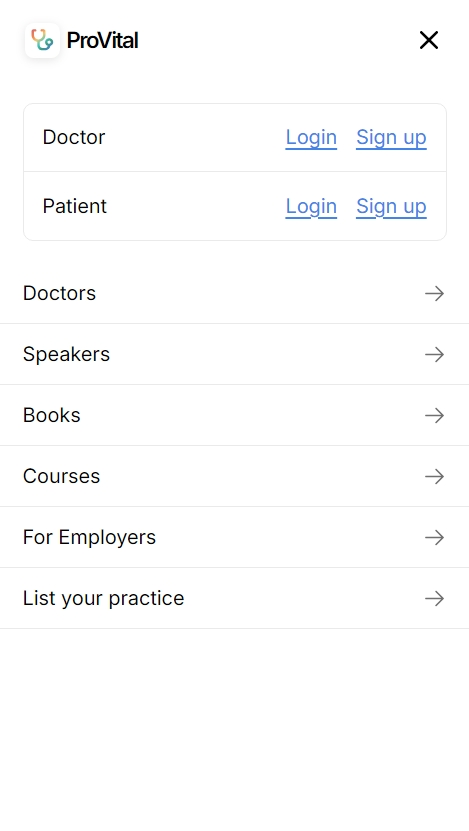

# Deployment

This project is deployed on Vercel. The live site can be accessed at https://proactively-frontend.vercel.app

# Technologies Used

- React.js + Vite
- Typescript
- CSS

# How to Run?

Use the following commands in your terminal:

```
git clone https://github.com/ayush-singh24/proactively-frontend

cd proactively-frontend

yarn install
```

### Development Environment

- To run the development environment use
  `yarn dev`
- Then visit https://localhost:8000/

### Production Environment

- To run the production environment use
  ` yarn preview`
- Then visit https://localhost:8001/

# Demo and Screenshots

## Desktop View


## Mobile View

### Homescreen



### Hamburger menu


